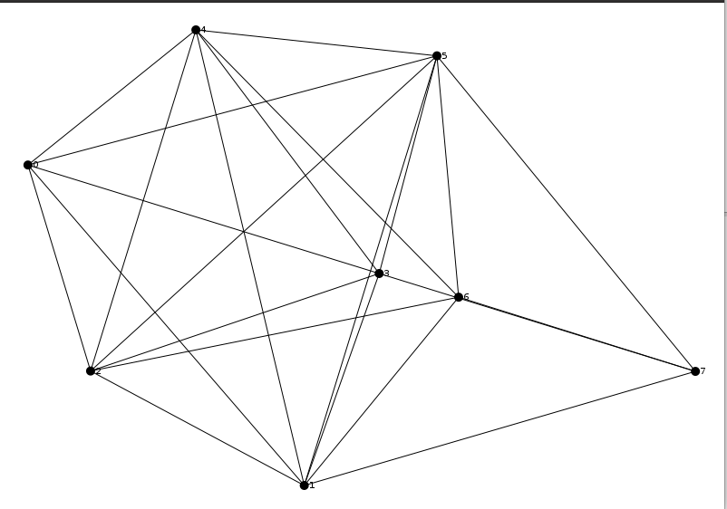
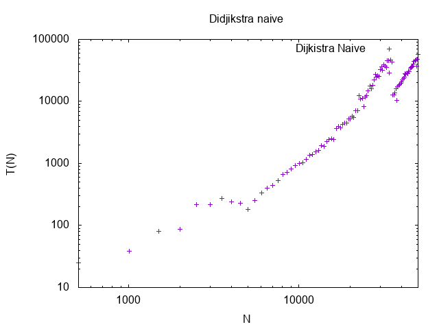
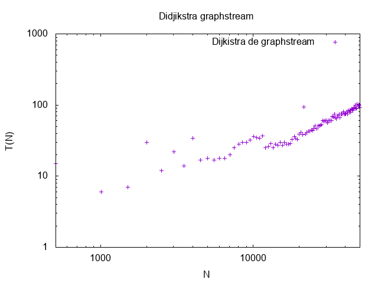
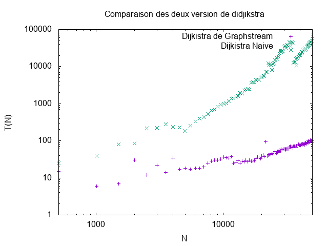

# Rapport de TP - Graphes

|Année|Filière|Matière|TP|Algo de Didjkstra|Réalisé par|
|--|--|--|--|--|--|
| 2021-2022 | M1 IWOCS | Graphes | Plus courts chemins |Didjkstra naive vs Didjkstra de graphstream| Ait Hammi Massinissa |

## Plan

* [Rappelle du projet](#rappelle-du-projet)
* [Utilite de l algorithme de didjkstra](#utilite-de-l-algorithme-de-didjkstra)
* [RandomGenerator](#randomgenerator)
* [Generateurs de graphes aleatoire](#generateurs-de-graphes-aleatoire)
* [Description de l algorithme naive de dijkstra](#description-de-l-algorithme-naive-de-dijkstra)
    - [***Parcours en largeur***](#parcours-en-largeur)
    - [***Fil d attente prioritaire***](#fil-d-attente-prioritaire)
    - [***Etapes de l algorithme***](#etapes-de-l-algorithme)
    - [***Complexite***](#complexite)
    - [***code generateur***](#code-generateur)
    - [***Fichier***](#fichier)
* [Description de l algorithme dijkstra de graphstream](#description-de-l-algorithme-dijkstra-de-graphstream)
* [Comparaison des deux version selon le temps d'execution](#comparaison-des-deux-version-selon-le-temps-d-execution)
    * [Temp d execution  naive didjikstra](#temp-d-execution-naive-didjikstra)
        * [***Code naive didjkstra***](#code-naive-didjkstra)
        * [***Stocker le resultat dans un fichier naive didjkstra***](#stocker-le-resultat-dans-un-fichier-naive-didjkstra)
        * [***Resultat naive didjkstra***](#resultat-naive-didjkstra)
        * [***Script gnuplot naive didjkstra***](#script-gnuplot-naive-didjkstra)
        * [***Resultat en image naive didjkstra***](#resultat-en-image-naive-didjkstra)
    * [Temp d execution graphstream didjikstraa](#temp-d-execution-graphstream-didjikstra)
        * [***Code graphstream didjikstra***](#code-graphstream-didjikstra)
        * [***Stocker le resultat dans un fichier graphstream didjikstra***](#stocker-le-resultat-dans-un-fichier-graphstream-didjikstra)
        * [***Resultat graphstream didjikstra***](#resultat-graphstream-didjikstra)
        * [***Script gnuplot graphstream didjikstra***](#script-gnuplot-graphstream-didjikstra)
        * [***Resultat en image graphstream didjikstra***](#resultat-en-image-graphstream-didjikstra)
    * [Temp d execution  comparaison](#temp-d-execution-comparaison)
        * [***Lancer les deux version***](#lancer-les-deux-version)
        * [***Fichier source***](#fichier-source)
        * [***Script gnuplot***](#script-gnuplot)
        * [***Resultat en image***](#reultat-en-image)
* [Quelques test en plus](#quelques-test-en-plus)
    * [Tester les deux methode pour voir les plus court chemain](#tester-les-deux-methode-pour-voir-les-plus-court-chemain)
        * [***Test des plus court chemain des deux version***](#test-des-plus-court-chemain-des-deux-version)
        * [***Test junit de la class naive didjikstra***](#test-junit-de-la-class-naive-didjikstra)
* [Conclusion](#conclusion)

## Rappelle du projet

Ceci est le rapport du travail effectué lors du TP de Graphes sur les plus courts chemins en utilisant deux version de l'algorithme de Didjikstra (naive et celle de graphstream)

Le but de ce [TP](https://eureka.univ-lehavre.fr/mod/assign/view.php?id=56242) est d'implémenter une version naïve de l'algorithme de Dijkstra vu en classe, puis de pouvoir comparer les résultats, notamment les performances produites par cet algorithme avec la version déjà disponible sur [GraphStream](https://graphstream-project.org/doc/Algorithms/Shortest-path/Dijkstra/) ([`documentation`](https://data.graphstream-project.org/api/gs-algo/current/org/graphstream/algorithm/Dijkstra.html)).

## Utilite de l algorithme de didjkstra


Pour ce projet, nous parierons sur les performances de notre implémentation de l'algorithme du plus court chemin. L'algorithme de Dijkstra calcule le chemin le plus court d'un nœud donné, appelé la source, à tous les autres nœuds du graphe. 
Il produit un arbre de chemin le plus court enraciné à la source. L'algorithme ne fonctionne que pour des longueurs non négatives, que nous utiliserons évidemment ici. Pour l'implémentation, nous utiliserons le générateur de graphes d'une taille donnée N déjà fourni par l'API Graphstream. 

Il existe  plusieurs générateurs:

* **Dorogovtsev-Mendes**
* **Barabasi-Albert**
* **. ...**

Chacun de ces générateur eux a ses spécificités mais nous allons ici nous intéresser au RandomGenerator.


## RandomGenerator


Ces algorithmes seront testés sur des graphes générés aléatoirement grâce au [Random graph generator](https://graphstream-project.org/doc/Generators/Random-graph-generator/) ([`documentation`](https://data.graphstream-project.org/api/gs-algo/current/org/graphstream/algorithm/generator/RandomGenerator.html)). Ici, nous devons travailler sur des graphes orientés pour faire la liste des plus courts chemins entre la source et tous les autres noeuds de notre graphe.

Afin d'expliquer au mieux la démarche suivie lors de ce travail, nous allons commencer par expliquer comment utiliser le [Random graph generator](https://graphstream-project.org/doc/Generators/Random-graph-generator/), décrire quel générateur nous avons utiliser et donner ses paramètres.
Par la suite, nous allons décrire les deux algorithmes de Dijkstra en commençant par la version naïve d'implémentée.
Enfin, nous terminerons par décrire les tests effectués afin de comparer les deux algorithmes, et nous présenterons les résultats obtenus sous forme brut et sous forme de graphes.

 Ce projet a été réalisé sous `JAVA` avec l'aide de la librarie [GraphStream](https://graphstream-project.org/)


## Generateurs de graphes aleatoire

Ce générateur crée des graphes aléatoires de taille arbitraire. Les liens du graph sont créés en fonction de seuils. Si la distance euclidienne entre deux nœuds est inférieure à un seuil donné, un lien est créé entre ces deux nœuds. Les appels à begin() placent un nœud dans le graphe, puis nextEvents() ajoute un nouveau nœud pour chaque appel et connecte ce nœud à ses voisins en fonction d'une distance plane euclidienne seuil. Le générateur est capable d'ajouter des valeurs choisies au hasard à n'importe quel attribut sur une arête ou un nœud du graphe, et de choisir au hasard la direction de l'arête.

Une liste de propriétés peut être fournie pour les nœuds et les arêtes. Dans ce cas, chaque nouveau nœud ou arête ajouté aura cette propriété et la valeur sera un nombre choisi au hasard. Vous pouvez spécifier une plage à partir de laquelle sélectionner ces nombres.
Par défaut, les arêtes n'ont pas de direction. Des directions peuvent être demandées, auquel cas les directions sont choisies au hasard.
En ce qui concerne la complexité de ce générateur, chaque appel à nextEvents() effectue au plus k opérations, où k est le degré moyen.

### ***code generateur***

Une première partie ou on crée et on donne quelques paramètres à notre générateur comme par exemple le fait que les arêtes soient orientées . Nous devons aussi donner aussi un degré moyen 

```java
	public RandomGenerator Gen_al(Graph graph ,double avrage_degree){
		RandomGenerator random_gen = new RandomGenerator(avrage_degree,false,true);
		random_gen.addEdgeAttribute("cap");
		random_gen.addSink(graph);
		return random_gen;
	}
```	

Dans cette partie on vas démarrer l'algorithme on lui donnant le génerateur crée précedamant avec un nombre de noued 


```java
	public void demarrer_genb(RandomGenerator gn , int nb_nd) {
		gn.begin();
		for (int i=0;i<nb_nd;i++) {
			gn.nextEvents();
		}
		gn.end();
	}

```
### ***fichier***
Le code se trouve dans le fichier [Generateur_Aleatoire.java](/src/main/java/tP3GraphePlusCourtChemin/Generateur_Aleatoire.java)

### ***Exemple en image***

  

## Description de l algorithme naive de dijkstra
On cherche  le chemin le plus court à partir d'un seul point(sommet) vers un autre point(sommet), disons X.

### ***Parcours en largeur***

Sa mise en oeuvre se base sur une recherche modifiée en largeur. La recherche en largeur d'abord (BFS) est un algorithme de traversée de graphe qui fonctionne en explorant d'abord tous les nœuds voisins, avant de passer au niveau suivant de voisins (voisins de voisins).

### ***Fil d attente prioritaire***

L'une des modifications de l'algorithme de Dijkstra sur la recherche en largeur d'abord est son utilisation d'une file d'attente prioritaire au lieu d'une file d'attente normale. Avec une file d'attente prioritaire, chaque noeud ajoutée à la file d'attente a une «priorité» et s'insérera en conséquence dans la file d'attente en fonction de son niveau de priorité.

### ***Etapes de l algorithme***

Initialiser le noeud source avec une distance de 0 puisque nous commençons à partir de celui-ci.
Initialiser tous les autres nœuds avec une distance infinie.
Démarrer la boucle de file d'attente après y avoir inséré notre nœud source.

Pour chaque voisin de notre nœud,  on calcul la distance provisoire entre la distance du nœud actuel et la distance à son voisin.
Si la distance provisoire est inférieure à la distance du voisin, définissez la distance de ce nœud voisin sur la distance provisoire et mettez-la en file d'attente avec cette distance comme priorité.
Continuez à travers la file d'attente prioritaire jusqu'à ce que nous ayons calculé le chemin le plus court de tous les nœuds vers la source
En option, nous pouvons fournir un nœud cible et dès que ce nœud est retiré de la file d'attente, nous pouvons arrêter notre recherche

### ***Complexite*** 

La compléxité depend en effet de l'implémenetation des fils d'attente prioritaires.
pour une simple liste sa compléxité sera de ***O(n²)*** alors que pour une liste triée elle sera de ***O(nm)***.

### ***Code***

- Constructeur :

 Pour le constructeur de la class on vas lui passer deux paramètre un graph et un noued source , on instancie aussi une Hashmap qui prend un Noeud comme clé et un double comme valeur
```java
    Graph graph; 
    Node source;
    HashMap<Node, Double> queue;
    public Dijkstra_naïve(Graph graph, Node noeud_source) {
        this.graph = graph;
        this.source = noeud_source;
        this.queue = new HashMap<Node, Double>();
    }
```
- Méthode init() :

on rajoute ici deux attributs à chaque noeud du graph distance et parent 

```java
   private void init() {
        for (Node n : graph.getEachNode()) {
            n.addAttribute("distance", n.getId().equals(source.getId()) ? 0 : Double.POSITIVE_INFINITY);
            n.addAttribute("parent", new Stack<Node>());
        }
    }
```
- Distance minimal :
```java
 private Node getMinDistanceNode(Set<Node> nodes) {
		        Node Min_Distance_Noued = null;
		        Double Min_Distance = Double.MAX_VALUE;
		        for (Node node : nodes) {
		            Double Noued_Ditance = node.getAttribute("distance");
		            if (Noued_Ditance < Min_Distance) {
		            	Min_Distance = Noued_Ditance;
		            	Min_Distance_Noued = node;
		            }
		        }
		        return Min_Distance_Noued;
		    }
```

- Méthode compute() : calculer le plus court chemin 

```java
    public void compute() {
    	init();
        queue.put(source, source.getAttribute("distance"));
        while (queue.size() != 0) {
            Node noued_courant = getMinDistanceNode(queue.keySet());
            Iterator<Edge> Iterator_Edge = noued_courant.getLeavingEdgeIterator();
            queue.remove(noued_courant);
            while (Iterator_Edge.hasNext()) {
                Edge Edge_Courant = Iterator_Edge.next();
                Node Noud_op = Edge_Courant.getTargetNode();
                if(! queue.containsKey(Noud_op)) {
                    Double Distance_Noued_Courant = noued_courant.getAttribute("distance");
                    Double Poid_Edge = Edge_Courant.getAttribute("cap");
                    Double somme = Distance_Noued_Courant + Poid_Edge;
                    Double Distance_Noued_op = Noud_op.getAttribute("distance");
                    if (Distance_Noued_op > somme) {
                    	Noud_op.setAttribute("distance", somme);
                    	Noud_op.setAttribute("parent", noued_courant);
                        queue.put(Noud_op, Noud_op.getAttribute("distance"));
                    }
                }
            }
        }
    }
```
### ***Fichier***

on retrouve ici le code source de la class [Dijkstra_naïve.java](/src/main/java/tP3GraphePlusCourtChemin/Dijkstra_naïve.java)


## Description de l algorithme dijkstra de graphstream

Graphstream nous met déja à disposition des algorithmes pour traiter nos graphes et a aussi implémenter sa version de Dijkstra.   En effet, cette implémentation utilise en interne Fibonacci Heap, une structure de données qui la rend plus rapide pour les gros graphiques.
Lors d'un appelle de la méthode compute(), l'algorithme calcul non seulement le plus court chemin d'un noeud source vers tout les autres mais aussi permet de prendre également en compte "les longeurs des noeuds" ainsi que d'autres fonctionnalités.

Voici un exemple de code:


```java
 Graph graph = ...;
 Dijkstra dijkstra = new Dijkstra(Dijkstra.Element.edge, "result", "length");
 // calcul le chemin le plus court dans le graphe à partire de A vers tout les autres noeuds
 dijkstra.init(graph);
 dijkstra.setSource(graph.getNode("A"));
 dijkstra.compute();
 // Affiche le plus court chemin entre les noeuds A et B
 System.out.println(dijkstra.getPath(graph.getNode("B"));
```

## Comparaison des deux version selon le temps d execution

Pour la procédure de test nous allons tour à tour mesurer le temps d'execution de ces deux algorithme en multipliant par pas de un le nombre de noeuds.
On va debuter avec un échantillon de 5000 noeuds

### Temp d execution  naive didjikstra

#### ***Code naive didjkstra***

```java
public void DidjikstraNaive(Graph graph) throws Exception {
...
int compteur=1,len=500,maximum=500;
.....
while(compteur<=100) {
             ...

            debut = System.currentTimeMillis();
			Dijkstra_naïve naivedidj = new Dijkstra_naïve(graph, graph.getNode(0));
			naivedidj.compute();
			fin =System.currentTimeMillis();
			temp=fin-debut;
            ....

            graph.clear();
			compteur++;
			len=maximum * compteur;
}
...
}
```
#### ***Stocker le resultat dans un fichier naive didjkstra***

```java
public void DidjikstraNaive(Graph graph) throws Exception {
...
int compteur=1 .. ;
....
BufferedWriter w = new BufferedWriter(new FileWriter("donnée/didjikstanaive.dat"));
while(compteur<=100) {
    ...
    w.write(String.format("%d%6d%n", graph.getNodeCount(),temp));
    }
    w.close();
}
```

#### ***Resultat naive didjkstra***

Le resultat vas se trouver dans le fichier [didjikstanaive.dat](/donnée/didjikstanaive.dat)


#### ***Script gnuplot naive didjkstra***
Le  script se trouver dans le fichier [script_Didjiksta_naive.gnu](/donnée/script_Didjiksta_naive.gnu)

#### ***Resultat en image naive didjkstra***
  

### Temp d execution graphstream didjikstra

#### ***Code graphstream didjikstra***

```java
public void DidjikstraGraphstream(Graph graph) throws Exception {
...
int compteur=1,len=500,maximum=500;
.....
while(compteur<=100) {
             ...

            debut=System.currentTimeMillis();
			Dijkstra dijkstra = new Dijkstra(Dijkstra.Element.EDGE, "result", "length");
			dijkstra.init(graph);
			dijkstra.setSource(graph.getNode(0));
			dijkstra.compute();
			fin=System.currentTimeMillis();
			temp=fin-debut;
            ....

            graph.clear();
			compteur++;
			len=maximum * compteur;
}
...
}
```
#### ***Stocker le resultat dans un fichier graphstream didjikstra***

```java
public void DidjikstraNaive(Graph graph) throws Exception {
...
int compteur=1 .. ;
....
BufferedWriter w = new BufferedWriter(new FileWriter("donnée/didjikstraGraphStream.dat"));
while(compteur<=100) {
    ...
    w.write(String.format("%d%6d%n", graph.getNodeCount(),temp));
    }
    w.close();
}
```

#### ***Resultat graphstream didjikstra***

Le resultat vas se trouver dans le fichier [didjikstraGraphStream.dat](/donnée/didjikstraGraphStream.dat)


#### ***Script gnuplot graphstream didjikstra***
Le  script se trouver dans le fichier [script_didjikstra_graphstream.gnu](/donnée/script_Didjiksta_naive.gnu)

#### ***Resultat en image graphstream didjikstra***
  


### Temp d'execution  comparaison 

 #### ***Lancer les deux version***

  ```java
    	Thread threadnaive = new Thread(()->{
			try {
				Didjk_naive_Temp.main(args);
				
			} catch (Exception e) {
				e.printStackTrace();
			}
		});
	   Thread threagraphstreamdidj = new Thread(()->{
			try {
				Didjk_GraphStream_Temp.main(args);
			} catch (Exception e) {
				e.printStackTrace();
			}
		});
	    threadnaive.start();
		threagraphstreamdidj.start();
  ```


#### ***Fichier source ***

Le fichier du code source est [Tester_temp_deux_version.java](/src/main/java/tP3GraphePlusCourtChemin/Tester_temp_deux_version.java)


#### ***Script gnuplot***
Le  script se trouver dans le fichier [script_comp.gnu](/donnée/script_comp.gnu)

#### ***Reultat en image***
  

## Quelques test en plus 
### Tester les deux methode pour voir les plus court chemain

 #### ***Test des plus court chemain des deux version***
Le fichier du code source est [Tester_temp_deux_version.java](/src/main/java/tP3GraphePlusCourtChemin/Tester_temp_deux_version.java)

#### ***Test junit de la class naive didjikstra***

Le fichier du code source est [Test.java](/src/test/java/tP3GraphePlusCourtChemin/Tester_temp_deux_version.java)

## Conclusion

On peu voir que plus le graphique est grand, plus il faut de temps pour implémenter l'algorithme Djikistra naive (vert). 
 
 O (M + N) est la complexité du code dans  la version naïve de l'algorithme de recherche en largeur. Ajoutez à cela  la recherche de l'élément de priorité la plus basse (min) de complexité O(N), à l'aide d'un algorithme de parcours simple. 
 
 Par contre, selon la documentation, l'algorithme fourni par GraphStream prend O (m + nlogn)  à chaque fois que vous appelez compute(). En fait, l'utilisation du tas de Fibonacci améliore les performances.
